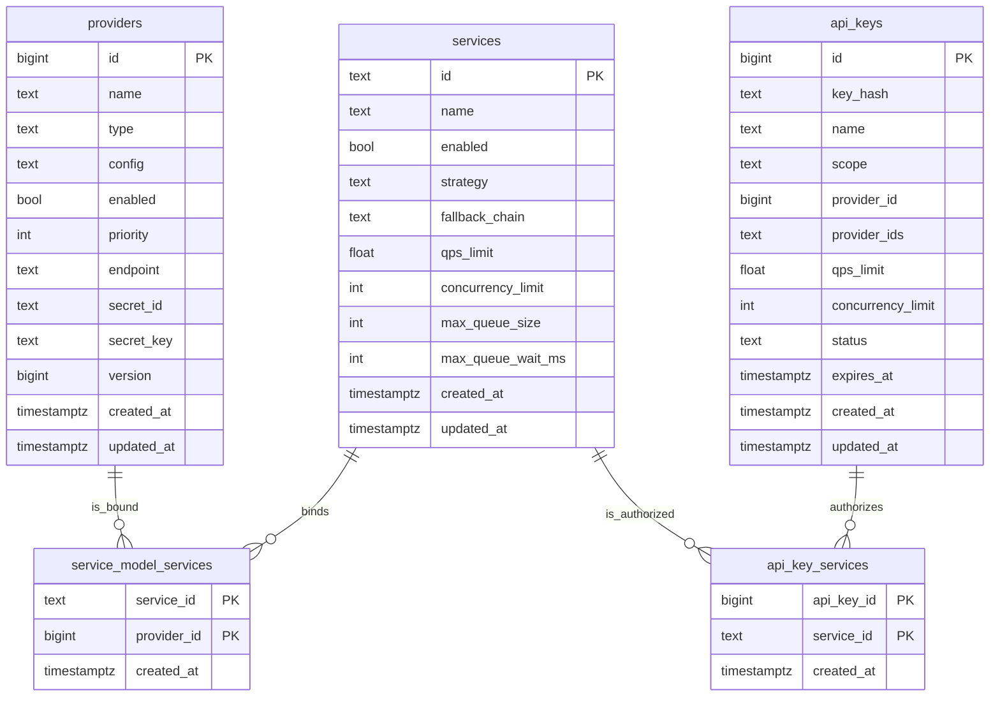
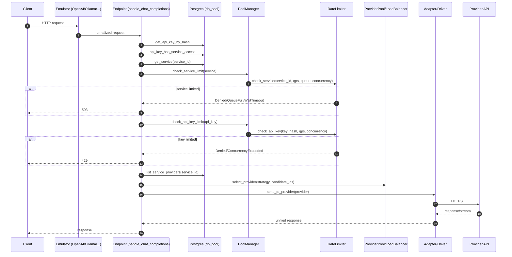

# LLM Link 架构说明（Gateway / 多模型服务）

本文档面向开发与运维，目的不是“概念图”，而是把当前实现里 **Service / API Key / Provider（模型服务）/ 负载均衡 / 限流与排队** 的真实数据结构与请求链路讲清楚。

## 1. 总体目标与边界

LLM Link 是一个多供应商模型网关：对客户端暴露统一协议（OpenAI / Ollama / Anthropic 等），内部将请求路由到不同 Provider，并在入口处完成：

1. API Key 鉴权与授权（能否访问某个 `service_id`）
2. 双层限流（Service 硬限制 503，API Key 软限制 429）
3. 负载均衡（按 Service 配置的策略在候选 Provider 里选一个）
4. 失败处理（Provider 级 failover / service 级 fallback_chain）

## 2. 核心实体与数据模型（DB + Rust）

系统对外主要抽象成三层：

- **Service（服务入口）**：对外可见的路由目标（请求体里显式传 `service_id`）；承载调度策略、回退链、服务级限流/排队。
- **API Key（调用方身份与配额）**：鉴权凭证；支持 key 级 QPS/并发（公平性软限制）。
- **Provider（模型服务/实例）**：实际调用的后端模型服务（OpenAI 兼容、云厂商、自建等），含连接与鉴权配置、优先级、可用性等。

### 2.1 数据表关系（PostgreSQL）

数据模型的关键在两张关联表：

- `service_model_services`：Service → Provider 的绑定（一个 Service 可以绑定多个 Provider 作为候选池）
- `api_key_services`：API Key → Service 的授权（当 key 的 scope=instance 时，必须显式授权才能访问）

来源：`migrations/postgres/011_add_services.sql`。

说明：

- `services` 的 4 个限流/队列字段来自 `migrations/postgres/012_add_service_limits.sql`。
- `api_keys` 里仍保留 `provider_id/provider_ids` 作为历史兼容；新模型优先使用 `api_key_services`。

### 2.2 Rust 侧结构体（权威来源）

权威结构体定义位于：`src/db/models.rs`。

- `Service`
  - `id/name/enabled/strategy/fallback_chain`
  - `qps_limit/concurrency_limit/max_queue_size/max_queue_wait_ms`
- `Provider`
  - `id/name/provider_type/config/enabled/priority/.../version`
- `ApiKey`
  - `key_hash/scope/qps_limit/concurrency_limit/status/expires_at/...`
- 关系表 struct：`ServiceModelService`、`ApiKeyService`

## 3. 运行时分层与职责

从代码结构看，可以把请求链路拆成 5 层：

1. **协议仿真层（Emulators）**：把 OpenAI/Ollama/Anthropic 等协议适配到统一内部入口。
   - 位置：`src/endpoints/emulators/`
2. **业务入口层（Endpoints）**：做鉴权、授权、限流、选路、转发、错误码语义。
   - 典型：`src/endpoints/chat.rs` 的 `handle_chat_completions`
3. **Pool 管理层（PoolManager / ProviderPool）**：管理 Provider 实例的可用性/健康/指标，提供候选选择能力。
   - 位置：`src/pool/manager.rs`、`src/pool/pool.rs`
4. **负载均衡与失败处理（LoadBalancer / Failover）**：策略选路、健康过滤、失败重试/切换。
   - 位置：`src/pool/load_balancer.rs`、`src/pool/failover.rs`、`src/pool/health.rs`
5. **适配器/驱动层（Adapter/Drivers）**：把统一请求真正发送到不同 Provider 的 HTTP API。
   - 位置：`src/adapter/`

## 4. 核心请求流程（以 `/v1/chat/completions` 为例）

该入口的“权威实现”在：`src/endpoints/chat.rs::handle_chat_completions`。

### 4.1 关键原则：先 Service（503），后 API Key（429）

这条顺序是有意设计的：

- **Service 维度**属于“保护系统整体能力”的硬限制，触发应返回 **503**。
- **API Key 维度**属于“多租户公平性”的软限制，触发应返回 **429**。

### 4.2 步骤拆解

请求（客户端）→ 协议仿真层 → 业务入口层后，依次执行：

1. 从 `Authorization: Bearer ...` 提取并校验 API Key
   - `db_pool.get_api_key_by_hash(...)`
2. 从请求体读取 `service_id`（严格模式：必须显式提供）
3. 授权检查：API Key 是否能访问该 Service
   - `db_pool.api_key_has_service_access(api_key, service_id)`
4. 读取 Service 配置（含策略与限流参数）
   - `db_pool.get_service(service_id)`
5. **Service 硬限流 + 有界队列 + 并发（503）**
   - `pool_manager.check_service_limit(&service)` → `rate_limiter.check_service(...)`
   - 可能返回：
     - `Denied`（QPS 不满足）→ 503
     - `QueueFull`（队列满）→ 503
     - `WaitTimeout`（排队等待超时）→ 503
6. **API Key 软限流 + 并发（429）**
   - `pool_manager.check_api_key_limit(key)` → `rate_limiter.check_api_key(...)`
   - 可能返回：
     - `Denied`（QPS 不满足）→ 429（带 `Retry-After`）
     - `ConcurrencyExceeded`（并发不满足）→ 429
7. 读取 Service 绑定的 Provider 候选集合
   - `db_pool.list_service_providers(service_id)`
8. 将 `service.strategy` 映射为 `LoadBalanceStrategy`，在候选集合里选择目标 Provider
   - `pool_manager.select_provider_from_candidates_with_strategy(strategy, candidate_ids, exclude)`
9. 进入 adapter/driver 发送请求，记录 metrics/health，并按 failover 机制尝试 fallback

### 4.3 流程图（入口到转发）

## 5. 双层限流与排队机制（实现细节）

实现位置：`src/pool/rate_limiter.rs`。

### 5.1 RateLimiter 的三个维度

- `global`：全局 token bucket（目前主要用于无 API key 的兼容模式）
- `api_keys`：按 `key_hash` 的 token bucket + semaphore（软限制）
- `services`：按 `service_id` 的 token bucket + semaphore + queue semaphore（硬限制 + 排队）

### 5.2 Service：QPS + 有界排队 + 并发

`check_service(service_id, config, max_queue_size, max_queue_wait)` 的语义是：

1. QPS：token bucket 不足则 `Denied { retry_after }`
2. queue：用 `service_queue_semaphores[service_id]` 控制“最多允许多少请求在等待区”
   - 拿不到则 `QueueFull`
3. concurrency：用 `service_semaphores[service_id]` 控制“同时执行中的请求数”
   - 在 `max_queue_wait` 内拿不到则 `WaitTimeout`
   - 拿到 permit 则返回 `Allowed { concurrency_permit }`

注意点：当并发上限/队列长度配置发生变化时，会重建对应 semaphore，避免“从大改小不生效”。

### 5.3 API Key：QPS + 并发

`check_api_key(key_hash, config)` 的语义是：

1. QPS：token bucket 不足 → `Denied { retry_after }`
2. concurrency：`try_acquire_owned()` 获取 semaphore
   - 获取失败 → `ConcurrencyExceeded`

## 6. 负载均衡与失败处理

### 6.1 负载均衡策略

策略枚举定义：`src/pool/load_balancer.rs::LoadBalanceStrategy`。

当前 Service 的 `strategy` 字段在入口处被映射为：

- `RoundRobin`
- `LeastConnections`
- `Random`
- `Priority`
- `LatencyBased`
- `LowestPrice`
- `QuotaAware`

具体选路行为由 `ProviderPool` 调用 `LoadBalancer` 完成：

- 先过滤健康实例（`HealthChecker`）
- 若无健康实例，降级到“从全部候选里选”
- 再按策略选择 provider id

### 6.2 Provider 级 failover（同一 Service 候选内）

failover 主要能力在 `src/pool/failover.rs`：

- 定义重试条件（网络/5xx/timeout/rate_limit/quota）
- 支持 backoff 策略
- 维护 provider 的 circuit breaker 状态

### 6.3 Service 级 fallback_chain（跨 Service 回退）

`services.fallback_chain` 是“跨 service 的回退链”配置。

入口层已经把 `fallback_chain` 做成可配置字段并写入 DB；实际跨 service 回退的生效点取决于 router/engine 层如何解释该字段（需要在后续继续把 fallback_chain 的解析与生效路径进一步固化/文档化）。

## 7. 管理端（Admin）到运行时生效链路

管理端的作用是写 DB，并在必要时同步 Pool 的运行时状态：

- Provider 的增删改：管理 API 更新 DB 后，调用 `pool_manager.add_provider/remove_provider/set_provider_enabled` 等，更新运行时 pool。
- Service 的配置（包括限流字段）：管理 API 写入 `services` 表；请求入口每次通过 `get_service/list_service_providers` 读取 DB，因此无需重启即可生效。
- API Key 的配置与授权：管理 API 更新 `api_keys` 与 `api_key_services`；入口每次鉴权/授权时读取 DB，因此无需重启即可生效。

## 8. 代码导航（按职责）

1. 数据结构：`src/db/models.rs`
2. Service DB 操作（含绑定/授权）：`src/db/operations/services.rs`
3. API Key DB 操作：`src/db/operations/api_keys.rs`
4. Chat 入口（鉴权/限流/选路/错误码）：`src/endpoints/chat.rs`
5. PoolManager：`src/pool/manager.rs`
6. ProviderPool / LoadBalancer / Health / Failover：`src/pool/pool.rs`、`src/pool/load_balancer.rs`、`src/pool/health.rs`、`src/pool/failover.rs`
7. RateLimiter（双层限流 + 排队）：`src/pool/rate_limiter.rs`
8. 真实转发：`src/adapter/*`