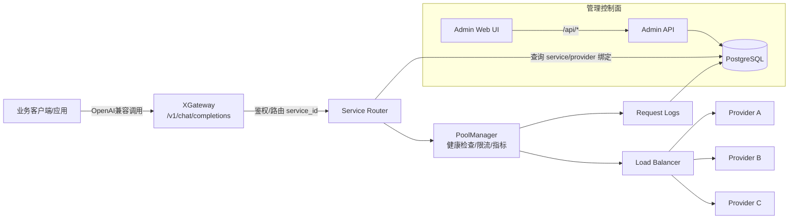
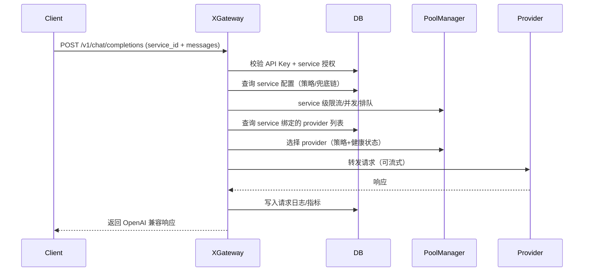

# XGateway 产品说明书

## 1. 文档信息

本文档用于对外介绍 XGateway 的定义、价值、能力边界与交付形态，面向客户、售前与交付人员。

## 2. 产品概述

XGateway 是面向大模型（LLM）的统一接入与治理网关。它把不同厂商、不同接口形态的模型服务实例（例如 OpenAI 兼容、Ollama、Anthropic 等）纳入统一的管理体系，对外提供稳定一致的调用入口，对内完成路由、负载均衡、限流与排队、健康检查、故障切换、权限控制与审计、日志与指标等治理能力。

在本项目中，XGateway 对业务侧提供 **OpenAI 兼容接口**（核心入口）：

`POST /v1/chat/completions`

并提供模型查询：

`GET /v1/models`

同时提供管理控制面（Admin API + Web UI），用于配置模型服务、编排对外服务（service）、下发访问授权（API Key）、查看监控与日志。

## 3. 产品定位与目标用户

XGateway 的定位是“LLM API 的统一入口 + 服务治理控制面”。

目标用户主要包括：

企业应用开发团队（作为统一调用入口）、平台/中台团队（作为模型服务治理能力）、运维与交付团队（作为可观测与运维工具）。

## 4. 典型业务场景

XGateway 适用于以下常见场景：

多供应商接入与切换（统一接口降低业务改造）、高可用与稳定性要求（健康检查与故障切换）、成本/配额优化（最低价格与配额感知策略）、企业级权限与治理（按服务授权、按服务限流、按服务观测）。

## 5. 核心概念（对外口径）

XGateway 采用“服务（service）驱动”的治理模型，减少业务侧对底层实例的直接耦合。

| 概念 | 含义 | 对外影响 |
| --- | --- | --- |
| Provider（模型服务实例） | 一条可直接调用的模型服务连接配置，如 OpenAI 兼容地址 + API Key + 默认模型/endpoint | 平台侧可增删改 provider；业务侧通常不直接绑定 provider |
| Service（对外服务） | 对外暴露的稳定调用目标，使用 `service_id` 标识；一个 service 可绑定多个 provider | 业务侧调用时以 `service_id` 为主；平台侧可调整策略与绑定 |
| API Key（访问密钥） | 控制调用方可访问哪些 service 的鉴权凭证 | 业务侧使用 `Authorization: Bearer <API_KEY>` |

## 6. 产品能力范围

### 6.1 对外调用能力（业务侧）

XGateway 对外提供 OpenAI 兼容的 `chat/completions` 语义。为了实现可治理的服务路由，当前实现要求请求体里携带 `service_id` 作为强约束路由字段。

### 6.2 管理与治理能力（平台侧）

能力以“模块化”呈现如下（以当前实现为准）：

| 模块 | 能力点 | 说明 |
| --- | --- | --- |
| 服务编排（Service） | service 创建/启停、绑定 providers、策略配置、fallback chain | service 是对外稳定单元，绑定多个 provider |
| 负载均衡 | 轮询、最少连接、随机、优先级、按延迟、最低价格、配额感知 | 策略由 service 配置决定 |
| 服务级流控 | QPS、并发上限、最大排队长度、最大排队等待时间 | 对 service 生效，避免高峰击穿 |
| 故障切换 | provider 级候选切换 + service 级 fallback chain | provider 不可用时自动选择其它候选；必要时切到备用 service |
| 健康检查 | 周期性探测 provider 可用性与延迟 | 健康状态用于调度与展示 |
| 可观测 | 指标与请求日志 | 便于排障与审计 |

### 6.3 非功能与交付口径（以当前实现为准）

XGateway 的非功能目标以“可治理、可观测、可控”为主，具体口径如下：

可用性与稳定性：通过 provider 健康检查、候选切换与 service fallback chain 降低单点故障影响。

容量与保护：通过 service 级 QPS/并发限制与有界队列（最大排队长度与等待时间）避免高峰期资源被耗尽。

可观测性：提供请求日志与关键指标统计，用于审计与排障。

## 7. 能力边界（本版本不包含的范围）

为避免对外口径与实现不一致，以下能力不在本文档承诺范围内（或需二次开发/扩展）：

不承诺具体 SLA 数值；不承诺完整的计费结算闭环；不承诺所有厂商的“全功能 API 兼容度”（以当前已支持的协议与驱动为准）。

## 8. 架构与关键流程

### 8.1 端到端架构



### 8.2 请求处理流程（简化）



## 9. 接入与使用

### 9.1 业务侧调用（curl）

当前实现要求请求体里提供 `service_id`。

```bash
curl -sS http://localhost:3000/v1/chat/completions \
  -H "Content-Type: application/json" \
  -H "Authorization: Bearer <YOUR_API_KEY>" \
  -d ' {
    "service_id": "demo-service",
    "model": "gpt-4o-mini",
    "messages": [
      {"role": "system", "content": "You are a helpful assistant."},
      {"role": "user", "content": "用一句话解释什么是 XGateway"}
    ]
  }'
```

流式返回：

```bash
curl -N http://localhost:3000/v1/chat/completions \
  -H "Content-Type: application/json" \
  -H "Authorization: Bearer <YOUR_API_KEY>" \
  -d ' {
    "service_id": "demo-service",
    "model": "gpt-4o-mini",
    "stream": true,
    "messages": [
      {"role": "user", "content": "给我一个三点式产品介绍"}
    ]
  }'
```

### 9.2 管理面入口（速查）

对外调用入口：

`POST /v1/chat/completions`

管理 API（平台运维）：

`/api/instances`（模型服务实例）

`/api/services`（对外服务与调度策略）

`/api/api-keys`（API Key 与授权）

`/api/pool/health`、`/api/pool/metrics`（健康与指标）

`/api/logs`（请求日志）

## 10. 实现对齐（关键代码片段）

### 10.1 强制 `service_id`（来自 `src/endpoints/chat.rs`）

```rust
// 2. STRICT MODE: Require explicit service_id in request
let service_id = match requested_service_id {
    Some(id) => id,
    None => {
        // Backward compatibility: allow provider_id to infer service_id when unambiguous.
        if let Some(provider_id) = requested_provider_id {
            match db_pool.list_service_ids_by_provider_id(provider_id).await {
                Ok(service_ids) => {
                    if service_ids.len() == 1 { service_ids[0].clone() }
                    else { /* 返回缺失 service_id 的错误 */ }
                }
                Err(e) => { /* 返回 server_error */ }
            }
        } else {
            /* 返回 missing_service_id */
        }
    }
};
```

### 10.2 按 service 策略选择 provider（来自 `src/endpoints/chat.rs`）

```rust
let strategy = match service.strategy.as_str() {
    "RoundRobin" => LoadBalanceStrategy::RoundRobin,
    "LeastConnections" => LoadBalanceStrategy::LeastConnections,
    "Random" => LoadBalanceStrategy::Random,
    "Priority" => LoadBalanceStrategy::Priority,
    "LatencyBased" => LoadBalanceStrategy::LatencyBased,
    "LowestPrice" => LoadBalanceStrategy::LowestPrice,
    "QuotaAware" => LoadBalanceStrategy::QuotaAware,
    _ => LoadBalanceStrategy::Priority,
};

let provider_id = pool_manager
  .select_provider_from_candidates_with_strategy(strategy.clone(), &candidate_provider_ids, None)
  .await;
```

## 11. 交付与部署形态（口径）

XGateway 以服务形式运行，对外提供 HTTP 接口并依赖数据库（PostgreSQL）存储配置、授权与日志。运行后会同时提供：业务侧 OpenAI 兼容入口、管理面 API 以及 Admin Web UI。

## 12. FAQ（对外沟通建议）

当客户问“能不能直接指定某个模型实例？”：建议引导使用 `service_id` 作为稳定契约，让平台侧在不改业务代码的情况下完成扩容、切换与容灾。

当客户问“兼容到什么程度？”：对外承诺 OpenAI 兼容的 `chat/completions` 入口与当前已支持的驱动能力，超出部分需要评估接口差异并按需适配。
